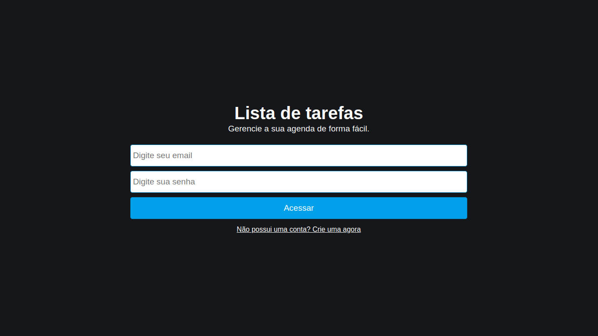
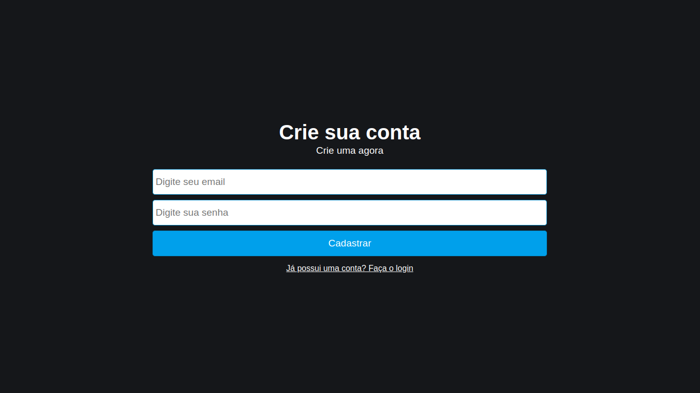
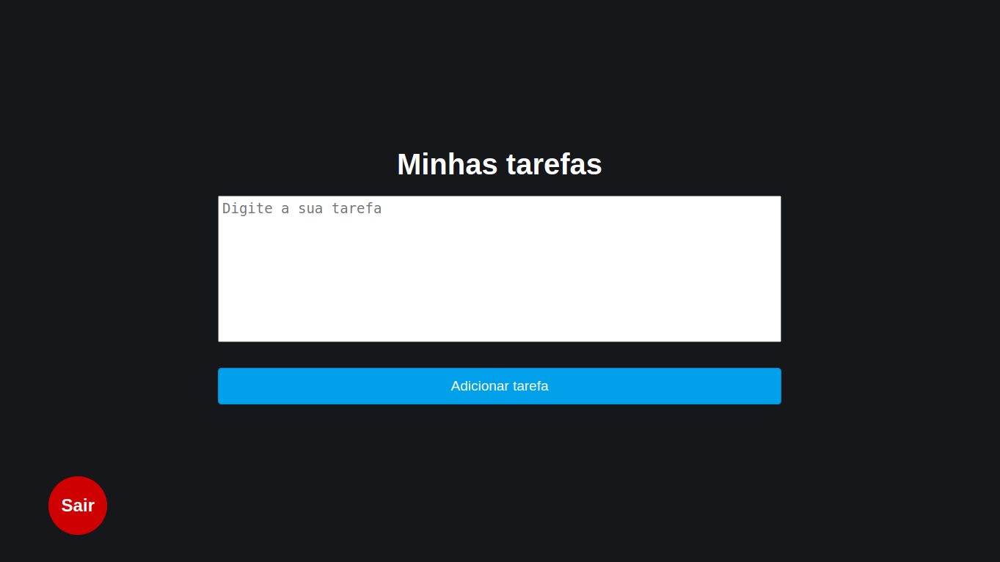

# Lista de tarefas 📚

## Informações ℹ️

<ul>
    <li>O projeto foi feito com um design bem simples para estudo da linguagem react, na qual o intuito é testar as funcionalidades do React</li>
    <li>O projeto tem um sistema de rotas utilizando o <b>react-router-dom</b> tendo apenas a rota para adicionar tarefas como privada</li>
    <li>O projeto tem um sistema de <b>Login</b> e de <b>Cadastramento</b> de usuários utilizando o FireBase</li>
    <li>O cadastramento de tarefas é lançado ao banco de dados e cada usuário tem as suas própias tarefas, na qual podem ser excluidas ou substituídas</li>
</ul>

## Tecnologias usadas 🖥️

<ul>
    <li>HTML 5</li>
    <li>CSS 3</li>
    <li>JAVASCRIPT</li>
    <li>REACT</li>
</ul>

## Capturas de tela 📸

 

 

## Executar projeto 🤓

<ul>
    <li>Instalar node em sua máquina</li>
    <li>Abrir projeto e dar npm start</li>
    <li>Ou vocẽ pode abrir o projeto na web <a href="https://tarefascomloginflzc.netlify.app/">Clicando aqui!</a></li>

</ul>

## Status do Projeto 📃

🚀 Concluído

## Contato 📞

<ul>
    <li><a href="https://github.com/fabriluan">Github</a></li>
    <li><a href="https://www.linkedin.com/in/fabricio-cipriano-a72672248/">Linkedin</a></li>
</ul>
